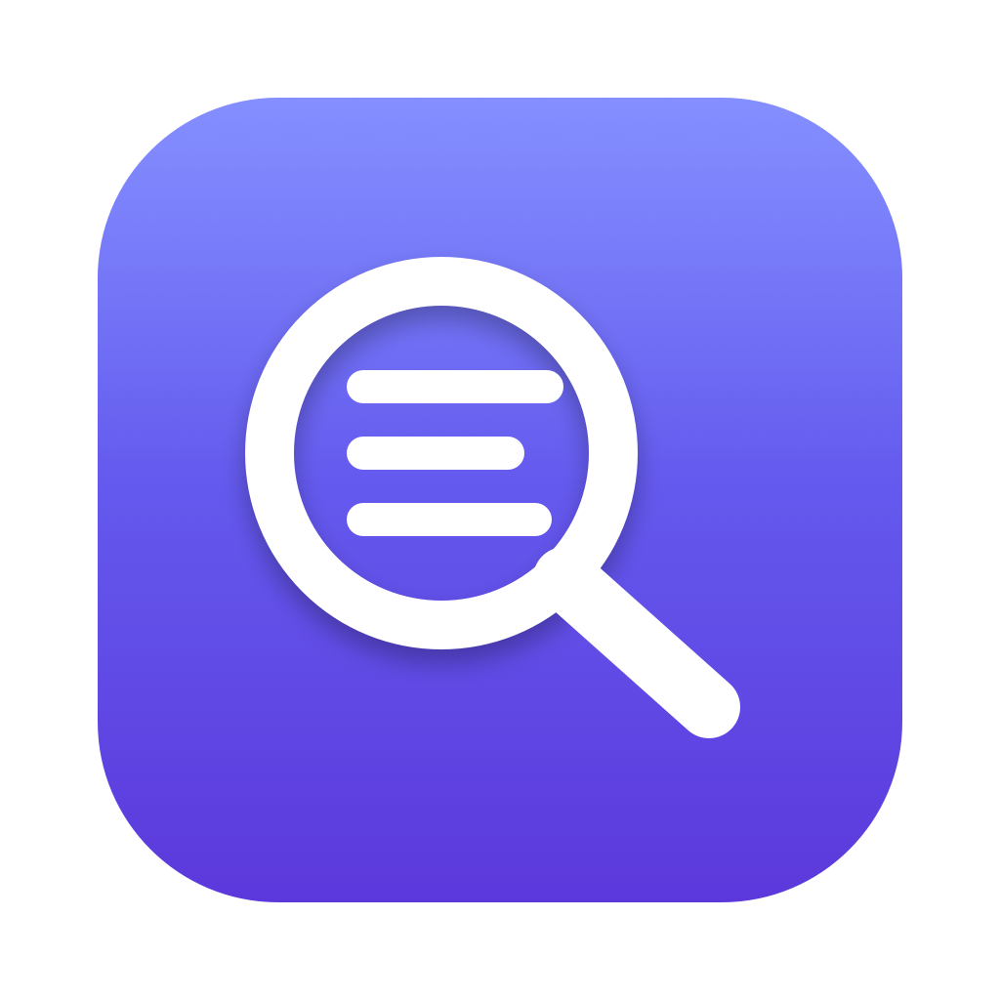
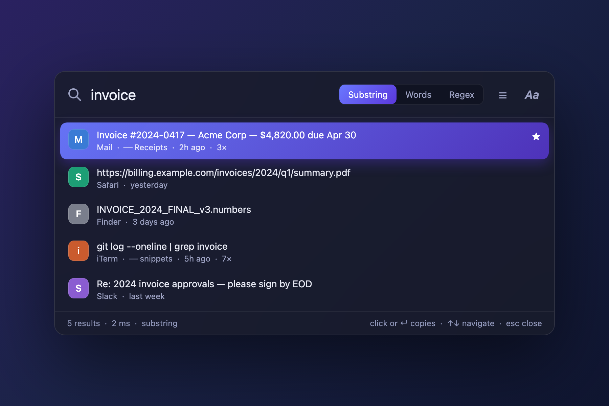

<div align="center">



# Stash

**A fast, local clipboard manager for macOS.**
Everything you copy, searchable in milliseconds from your menu bar.




</div>

## Install

1. Download **Stash.dmg** from the [latest release](https://github.com/Alyetama/Stash/releases/latest) and open it.
2. Drag **Stash** into **Applications** and launch it.

> [!IMPORTANT]
> **On first launch, macOS will block Stash** — it's open-source and unsigned (no paid Apple Developer ID). One-time fix:
> open **System Settings → Privacy & Security**, scroll down, and click **Open Anyway** next to the message about Stash, then confirm.

Press <kbd>⌃</kbd><kbd>⌥</kbd><kbd>C</kbd> (or click the menu-bar icon) to open Stash and start searching.

## Features

- **Instant search** over your whole history — substring, whole-word, or regex. Still fast past a million clips.
- **Captures everything** — text, images, and GIFs (PNG, JPEG, WebP, AVIF, HEIC, and more), tagged with the app they came from.
- **Groups & favorites** — sort clips into named groups, star the ones you reuse, filter to either.
- **Smart duplicates** — re-copying something moves it to the top instead of piling up a second copy (or keep every copy, your call).
- **Copy transformations** — change case, trim, single-line, prepend/append, applied as you copy.
- **AI regex** *(optional)* — describe a pattern in plain English, a free model writes the regex. Off until you add a key, which lives in your Keychain.
- **Six dark themes**, a compact or centered panel, a global shortcut you can rebind.
- **100% local** — no accounts, no telemetry, clips never leave your Mac.

## Privacy

Stash stores everything in a single local SQLite database at `~/Library/Application Support/Stash/`. Nothing is uploaded. The only feature that ever makes a network request is the opt-in AI regex helper, and only after you add an API key.

## Coming from Copy 'Em?

Stash can import your existing [Copy 'Em](https://apprywhere.com) history — text, images, and lists — straight from **Settings → Import**. It reads Copy 'Em's data strictly read-only and never modifies it. Stash works fully on its own; this is just for migrating.

## Build from source

Requires the Swift toolchain (Swift 5.9+, included with Xcode).

```bash
git clone https://github.com/Alyetama/Stash.git && cd Stash
./build.sh        # build + install to /Applications
./make-dmg.sh     # build + package dist/Stash.dmg
```

## Uninstall

Quit Stash, delete it from Applications, and remove `~/Library/Application Support/Stash/`.

## License

[MIT](LICENSE)
